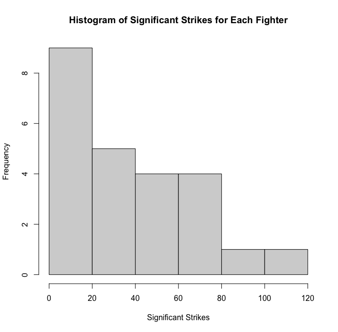

# UFC Event Web Scraper

This is a simple web scraper that can be used to convert stats from a ufc event into a tibble that can then be used for data analysis. The table is scraped from the following link: <http://www.ufcstats.com/event-details/6f81b6de2557739a>

A page like this exists for every UFC Event.

The analysis done for this one event is a simple histogram of the significant strikes landed by each fighter. 

## Import Libraries

```{r libraries}
library(rvest)
library(tidyverse)
```

## Scraping the table
```{r html}
url = "http://www.ufcstats.com/event-details/6f81b6de2557739a"

html = read_html(url)

td = html %>%
  html_elements('td') %>%
  html_text2()
```

## Cleaning table data
### Function for cleaning some of the columns
```{r function}
columnCleaner <- function(td, index) {
  varvec <- ""
  for (i in seq(index, 120, by=10)) {
    varvec <- c(varvec,unlist(strsplit(td[i], "\n")))
  }
  
  varvec <- varvec[varvec != ""]
  
  return(varvec)
}

names <- columnCleaner(td, 2)
```

### Format table into a data frame
```{r dataframe}
nashville23 <- tibble(W_L=rep("",24),
                          Fighter=columnCleaner(td,2),
                          KD=columnCleaner(td,3),
                          STR=as.integer(columnCleaner(td,4)),
                          TD=columnCleaner(td,5),
                          SUB=columnCleaner(td,6)
                          #Weight_Class=rep(NA,24),
                         # Method=rep(NA,24),
                          #Round=rep(NA,24),
                          #Time=as.Date(columnCleaner(td,10))
                      )

```

### Add values to W/L Column
We know from the source table that every odd index has the winner
```{r W/L Column}
for (i in seq(1:length(nashville23$W_L))){
  if (i%%2 == 1){
    nashville23$W_L[i] <- "W"
  }
  else {
    nashville23$W_L[i] <- "L"
  }
}

```

### Add weight class column

```{r Weight Class Column}
weight <- columnCleaner(td, 7)
duplicatedWeights <- ""
for (i in seq(1:length(weight))){
  duplicatedWeights <- c(duplicatedWeights, c(weight[i], weight[i]))
}
duplicatedWeights <- duplicatedWeights[duplicatedWeights != ""]

nashville23$Weight_Class <- duplicatedWeights

nashville23
```


## Finally, the Histogram


```{r histogram, echo=FALSE}
hist(nashville23$STR, main = "Histogram of Significant Strikes for Each Fighter",
     xlab="Significant Strikes")
```



